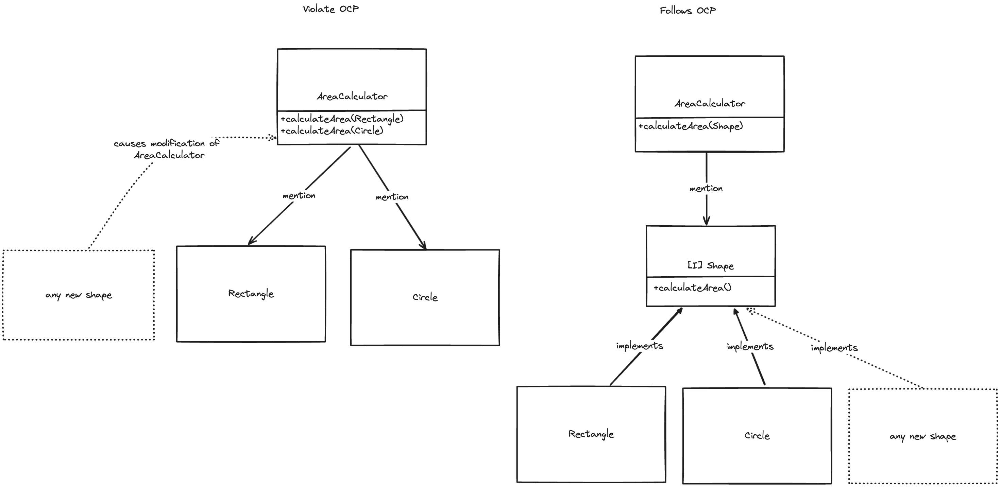

 # SOLID Principles in Java
SOLID is an acronym for five object-oriented design principles:

1. Single Responsibility Principle (SRP)
2. Open-Closed Principle (OCP)
3. Liskov Substitution Principle (LSP)
4. Interface Segregation Principle (ISP)
5. Dependency Inversion Principle (DIP)

## 1. Single Responsibility Principle (SRP)[^1]

- A class should have only one reason to change, meaning it should have only one job or responsibility.
### Description of SRP from Uncle Bobs Clean Architecture

- *Software systems are changed to satisfy users and stakeholders; those users and
 stakeholders are the “reason to change” that the principle is talking about.  
 Indeed, we can rephrase the principle to say this:*[^1]
  - *A module should be responsible to one, and only one, user or stakeholder.*" 
- As most of the time we have more than one user we are actually talking about a group of people, Uncle bob refers to the group as an *actor*
- *A module should be responsible to one, and only one, actor*[^1]

### Example (Clean Architecture)
	
```java
// Bad example: violates SRP
class Employee {
  public void calculatePay() { /* ... */ }
  public void saveEmployee() { /* ... */ }
  public void generateReport() { /* ... */ }
}

// Good example: follows SRP
class EmployeeData {
  private String name;
  private double salary;
  // getters and setters
}

class PayrollCalculator {
  public double calculatePay(Employee employee) { /* ... */ }
}

class EmployeeRepository {
  public void saveEmployee(Employee employee) { /* ... */ }
}

class ReportGenerator {
  public void generateReport(Employee employee) { /* ... */ }
}
```
- *The Employee class violates the SRP because those three methods are responsible to three very different actors*.[^1]
  - *The calculatePay() method is specified by the accounting department, which reports to the CFO.*
  - *The reportHours() method is specified and used by the human resources department, which reports to the COO*.
  - *The save() method is specified by the database administrators (DBAs), who report to the CTO.*
- *By putting the code for these methods into a single Employee class, the actors are coupled together. <br>The actions of the CFO could affect those of the COO or CTO.*[^1]

## 2. Open-Closed Principle (OCP)[^2]

- Software entities should be open for extension but closed for modification.
- In a ideal software architecture, new requirements should reduce the amount of changes to the old code to a minimum.
- *This is done by applying the Single Responsibility Principle and organising the dependencies between them properly in a dependency hierarchy* [^2]
- Higher-level components should be protected of the change from lower level components.

### Example

```java
  // Bad example: violates OCP
  class Rectangle {
    protected double width;
    protected double height;
    // getters and setters
  }
  
  class AreaCalculator {
    public double calculateArea(Rectangle rectangle) {
        return rectangle.getWidth() * rectangle.getHeight();
    }
  }
  
  // Good example: follows OCP
  interface Shape {
    double calculateArea();
  }
  
  class Rectangle implements Shape {
    private double width;
    private double height;
    
    @Override
    public double calculateArea() {
        return width * height;
    }
  }
  
  class Circle implements Shape {
    private double radius;
    
    @Override
    public double calculateArea() {
        return Math.PI * radius * radius;
    }
  }
  
  class AreaCalculator {
    public double calculateArea(Shape shape) {
        return shape.calculateArea();
    }
  }
```



## 3. Liskov Substitution Principle (LSP)[^3]

Objects of a superclass should be replaceable with objects of its subclasses without affecting the correctness of the program.

### Example
- In mathematics, a Square is a special case of a Rectangle but modeling your program that way doesn't always work.

```java
// Bad example: violates LSP
class Rectangle {
  protected int width;
  protected int height;
  
  public void setWidth(int width) {
      this.width = width;
  }
  
  public void setHeight(int height) {
      this.height = height;
  }
  
  public int getArea() {
      return width * height;
  }
}

class Square extends Rectangle {
  @Override
  public void setWidth(int width) {
      super.setWidth(width);
      super.setHeight(width);
  }
  
  @Override
  public void setHeight(int height) {
      super.setWidth(height);
      super.setHeight(height);
  }
}

// Good example: follows LSP
interface Shape {
  int getArea();
}

class Rectangle implements Shape {
  protected int width;
  protected int height;
  
  public void setWidth(int width) {
      this.width = width;
  }
  
  public void setHeight(int height) {
      this.height = height;
  }
  
  @Override
  public int getArea() {
      return width * height;
  }
}

class Square implements Shape {
  private int side;
  
  public void setSide(int side) {
      this.side = side;
  }
  
  @Override
  public int getArea() {
      return side * side;
  }
}

public static void main(String[] args){
  // bad example -> fails, because square and rectangle are not interchangable
  Rectangle r = Square();
  r.setW(5);
  r.setH(2);
  assertTrue(r.area() == 10);
}
```

- in the bad example, you can't substitute the `Rectangle` implementation with a `Square`, because calling `setW()` and `setH()` causes change in height and width
  which in return effects the area calculation on consecutive calls and  
  the assert would fail  
- by implementing this concrete Shape Interface, 
  all classes that implement `Shape` and overrides `getArea()` function can be substituted with each other in this use case  

## 4. Interface Segregation Principle (ISP)[^4]
  
Many client-specific interfaces are better than one general-purpose interface.

### Example

```java
// Bad example: violates ISP
interface Worker {
  void work();
  void eat();
  void sleep();
}

class Human implements Worker {
  public void work() { /* ... */ }
  public void eat() { /* ... */ }
  public void sleep() { /* ... */ }
}

class Robot implements Worker {
  public void work() { /* ... */ }
  public void eat() { /* Not applicable */ }
  public void sleep() { /* Not applicable */ }
}

// Good example: follows ISP
interface Workable {
  void work();
}

interface Eatable {
  void eat();
}

interface Sleepable {
  void sleep();
}

class Human implements Workable, Eatable, Sleepable {
  public void work() { /* ... */ }
  public void eat() { /* ... */ }
  public void sleep() { /* ... */ }
}

class Robot implements Workable {
  public void work() { /* ... */ }
}
```
- Bad Example:
  - What it does:
  	- The `Worker` interface defines three methods: `work()`, `eat()`, and `sleep()`.
  	- Both `Human` and `Robot` implement `Worker`. However, `Robot` has to implement methods (`eat()` and `sleep()`) that are irrelevant to its behavior.
  - Why it's bad:
  	- **Violates Interface Segregation Principle (ISP):** ISP states that interfaces should be small and specific to the needs of their clients. `Robot` is forced to implement `eat()` and `sleep()`, which it doesn’t use.
- Good Example:
  - What it does:
  	- Separates the `Worker` interface into three smaller, focused interfaces: `Workable`, `Eatable`, and `Sleepable`.
  	- `Human` implements all three interfaces because it performs all three actions.
  	- `Robot` only implements `Workable`, as it doesn’t eat or sleep.
  - Why it's good:
  	- **Follows ISP:** Each interface is designed for a specific behavior, and classes only implement the interfaces they actually use.
  	- **Flexible and extensible:** Adding new types of workers (e.g., an animal that eats and sleeps but doesn’t work) doesn’t affect existing code. You simply implement the relevant interfaces.
  	- **Readable and maintainable:** It’s clear which classes are capable of which behaviors, reducing the risk of errors or unnecessary code.

- This way you can compose different behaviours by implementing multiple interfaces and leave out the ones you don't need
- Uncle Bob also describes that languages like Java need to recompile and redeploy changes made to all dependant classes
	- For example in the bad example changes to the `sleep()` method would force a recompile to the `Robot` class which does not need to sleep

## 5. Dependency Inversion Principle (DIP)[^5]

  High-level modules should not depend on low-level modules. Both should depend on abstractions.  
- We tend to ignore stable dependencies like the operating system, because we can rely on them not to change.
	- for example the String class is a concrete class which we don't abstract away because it's stable and can rely on it not to change
- The concrete elements in our system that are under constant change are the ones we want to avoid depending on

### Example

```java
// Bad example: violates DIP
class EmailSender {
  public void sendEmail(String message) {
      // Send email logic
  }
}

class Notification {
  private EmailSender emailSender;
  
  public Notification() {
      this.emailSender = new EmailSender();
  }
  
  public void send(String message) {
      emailSender.sendEmail(message);
  }
}

// Good example: follows DIP
interface MessageSender {
  void sendMessage(String message);
}

class EmailSender implements MessageSender {
  @Override
  public void sendMessage(String message) {
      // Send email logic
  }
}

class SMSSender implements MessageSender {
  @Override
  public void sendMessage(String message) {
      // Send SMS logic
  }
}

class Notification {
  private MessageSender messageSender;
  
  public Notification(MessageSender messageSender) {
      this.messageSender = messageSender;
  }
  
  public void send(String message) {
      messageSender.sendMessage(message);
  }
}
```
- Bad Example:
    - What it does:
    	- The `Notification` class is tightly coupled to the `EmailSender` class.
    	- Inside its constructor, `Notification` directly instantiates `EmailSender`.
    - Why it's bad:
    	- **Violates Dependency Inversion Principle (DIP):** DIP states that high-level modules (e.g., `Notification`) should depend on abstractions, not concrete implementations (e.g., `EmailSender`).
    	- **Lack of flexibility:** If you need to add another sender (like SMS), you must modify the `Notification` class, breaking the **Open/Closed Principle (OCP)**.
    	- **Hard to test:** It’s challenging to replace `EmailSender` with a mock during unit testing.
- Good Example:
    - What it does:
    	- Introduces an abstraction (`MessageSender` interface) to define a common behavior (`sendMessage`).
    	- `Notification` depends on this abstraction rather than concrete implementations.
    	- `EmailSender` and `SMSSender` implement the `MessageSender` interface.
    - Why it's good:
    	- **Follows DIP:** `Notification` depends on the `MessageSender` interface (an abstraction) rather than specific classes (`EmailSender` or `SMSSender`).
    	- **Flexible:** Adding new message types (e.g., push notifications) is easy by creating a new implementation of `MessageSender`. No changes are required in `Notification`.
    	- **Testable:** You can inject a mock `MessageSender` to test `Notification` without depending on actual implementations.
    	- **Extensible and maintainable:** By separating the interface from implementations, the code adheres to the **Single Responsibility Principle (SRP)** and is easier to maintain.

- we can't completely remove dependencies to concrete implementations but try to minimize it

## Sources
### *__Clean Architecture: A Craftsman's Guide to Software Structure and Design__*

## Sources
### *__Clean Architecture: A Craftsman's Guide to Software Structure and Design__*

[^1]: Chapter 7 SRP: The Single Responsibility Principle
[^2]: Chapter 8 OCP: The Open-Closed Principle
[^3]: Chapter 9 LSP: The Liskov Substitution Principle
[^4]: Chapter 10 ISP: The Interface Segregation Principle
[^5]: Chapter 11 DIP: The Dependency Inversion Principle
